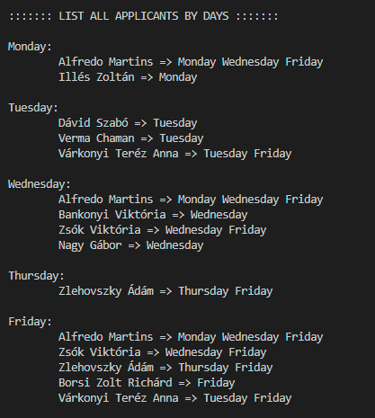

# PROCESSES TASK

Spring is also knocking on the door of the "Drink My Friend" vineyard. As we all know, grapes love care and work, but most of all they love labour, which is usually rewarded with a good harvest. The vineyard needs a lot of helpers, so an application is being prepared for those who want to apply for a job.

Applicants are invited from those who can work during the weeks of the spring season. When applying, they should give their name and which days of the week they can go to work. The days are given as follows: Monday Wednesday Thursday. Candidates will separate the days with a space. The farm knows how many workers it needs on which days (Mondays, Tuesdays, etc.). If a day is already full, the application should not accept applicants for that day.

The data of the applicants will be stored in a file, and in addition to the data entry, we should have the possibility to modify, delete and create a list of applicants by days or a complete list of applicants.

Create a C language program to perform this task, the solution should run either on opsys.inf.elte.hu or on a Linux system similar to it. The solution must be presented to the tutor during the week following the deadline.

## Instructions
Run the following command in the linux terminal line:

```
chmod u+x main.c
gcc main.c -o vineyard && ./vineyard config.dat record.dat

```

___
## Screenshots

1. Main(menu) screen
    <br>
    
    <br>
2. Insertion
    <br>
    
    <br>
    
    <br>
3. Remove
    <br>
    
    <br>
    
    <br>
    
    <br>
4. List all applicants
    <br>
    
    <br>
5. Modify
   <br>
    
   <br>
    
   <br>
    
   <br>
    
   <br>
6. Dismiss
    <br>
    
    <br>

> Made by MARTINS Alfredo.
